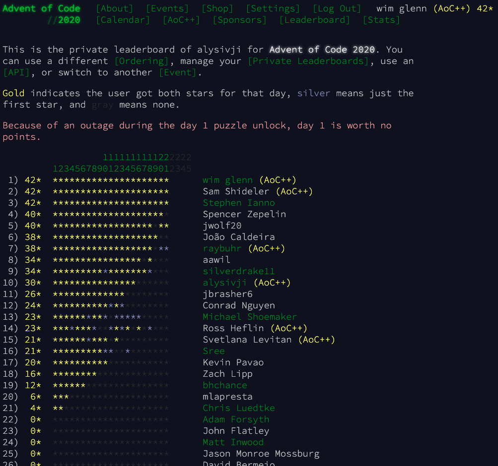

# last-star-timestamp column on your private leaderboards

Here's a script for showing the time of last star on your private leaderboards. I've tried not to mess up the minimalist aesthetic of the website. It looks like this (before/after):

There are no background API requests, the time of last star information is already there in the document, although not visible by default. The userscript just adds a new column into the table to display that information.

To get this:

- Install [tampermonkey extension](https://www.tampermonkey.net/) if you don't have it already
- Click the raw button on ``leaderboard-star-ts.user.js`` or visit the direct link: https://github.com/wimglenn/userscripts/raw/master/adventofcode.com/leaderboard-star-ts.user.js
- A tampermonkey dialog should appear, on which you can click "Install"

_Note: the extra column is only available when the ``[Ordering]`` mode is using ``?order=stars``._

If you like it, please **[⬆  upvote this craft submission here](https://www.reddit.com/r/adventofcode/comments/k4emxn/advent_of_code_2020_craft_submissions_megathread/ggkfez4?utm_source=share&utm_medium=web2x&context=3)**.

## My other AoC stuff:

- [advent-of-code-data](https://github.com/wimglenn/advent-of-code-data): Get your puzzle data with a single import statement.
- [advent-of-code-wim](https://github.com/wimglenn/advent-of-code-wim): Solutions in Python, since 2015.
